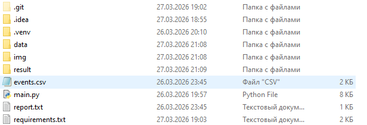

# Задача
## Прототип системы детекции уборки столиков по видео

### Цель: Создать упрощенный, но рабочий прототип на 1 видео, который демонстрирует основной пайплайн обработки

 - Требования:

1. Детекция событий (ОСНОВНОЕ):
   Упрощенный подход к детекции: Вместо обучения сложных моделей используй детекцию движения (вычитание фона в OpenCV) или готовую YOLO-модель (например, YOLOv8n от Ultralytics) для обнаружения людей (без разделения на гостей и сотрудников по униформе).
   Логика для одного столика: Выбери один четко видимый столик на видео и отслеживай события только для него (определи его координаты вручную, через cv2.selectROI).
   Фиксация трех основных событий:
  Стол пустой (людей в зоне нет)
Стол занят (есть человек в зоне)
Подход к столу (появление человека в зоне после периода пустоты).

2. Аналитика (БАЗОВАЯ):
   Записывай временные метки всех событий в Pandas DataFrame.
   Для каждого случая, когда стол стал пустым, определи, через какое время к нему подошел следующий человек.
   Посчитай базовую статистику: "Среднее время между уходом гостя и подходом следующего человека".

3. Визуализация (МИНИМУМ):
   Обязательно: Нарисуй на видео bounding box для выбранного столика. Меняй его цвет в зависимости от состояния (например, зеленый - пусто, красный - занято).
   По желанию (если останется время): Выведи в консоль или простой текстовый файл отчет со средней задержкой.

   Python 3.8+
   OpenCV (для работы с видео, вычитания фона, рисования)
   Pandas (для таблицы с событиями)
   Ultralytics (YOLO) или OpenCV с готовыми DNN-моделями (для быстрой и простой детекции людей)

 - Формат результата:

1.  Код: Один хорошо закомментированный Python-скрипт (main.py), который запускается командой python main.py --video video1.mp4.
2.  Отчет: Краткий README.md в репозитории, где описано:
       Как запустить проект (установить зависимости pip install -r requirements.txt).
       Какое видео и какой столик были выбраны.
       Какая логика использовалась для детекции событий.
       Полученный результат (среднее время задержки для выбранного видео).
       Пример проблемного кадра (скриншот).
3.  Результат работы: Полученное видео с визуализацией (output.mp4).
# Как решал
## "Цель: создать систему автоматического мониторинга загруженности зоны обслуживания без оператора."
### "Используемые технологии:"
- Yolo v8 для распознавания людей в видео
- OpenCV для отслеживания этих людей в течении времени
# Что выдает file [events.csv]

# До обработки 
# После обработки 
<h3>После завершения в папке results/ появятся:output.mp4 — видео с визуализацией состояний столика;events.csv — таблица событий;report.txt — краткий текстовый отчёт со средним временем задержки.<h3>

### Пример запуска

Положите видео в `data/video1.mp4`, установите зависимости и запустите скрипт:

```bash
pip install -r requirements.txt
python main.py --video data/video1.mp4 --output results/output.mp4
```
> [!IMPORTANT]
> Можно просто запустить `start.bat` если:
> - видео для обработки находиться в `data/`
>  - называется `vid_1.mp4`
> - тогда обработанное видео будет в `result/`
>   - с названием `video_reg_1.mp4`

[](img2.png)
## После выделения рамки на изображении нажмите ENTER
[](img1.png)
## После процесса появляются файлы:
[](img_file.png)
## Примеры проблемных кадров находятся в папке <h3>problem_img</h3>
