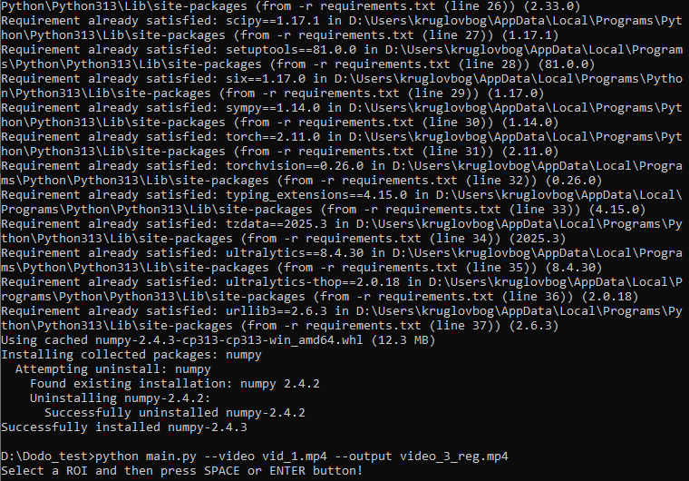

<h1>Прототип системы детекции уборки столиков по видео</h1>
<h2>1. Назначение</h2>
  <h3><h3>

<h3>После завершения в папке results/ появятся:output.mp4 — видео с визуализацией состояний столика;events.csv (если реализовано) — таблица событий;report.txt (если реализовано) — краткий текстовый отчёт со средним временем задержки.<h3>

### Пример запуска

Положите видео в `data/video1.mp4`, установите зависимости и запустите скрипт:

```bash
pip install -r requirements.txt
python main.py --video data/video1.mp4 --output results/output.mp4

[](img2.png)
<h2>1. После выделения рамки на изображении нажмите ENTER</h2>
[](desktop.jpg)

